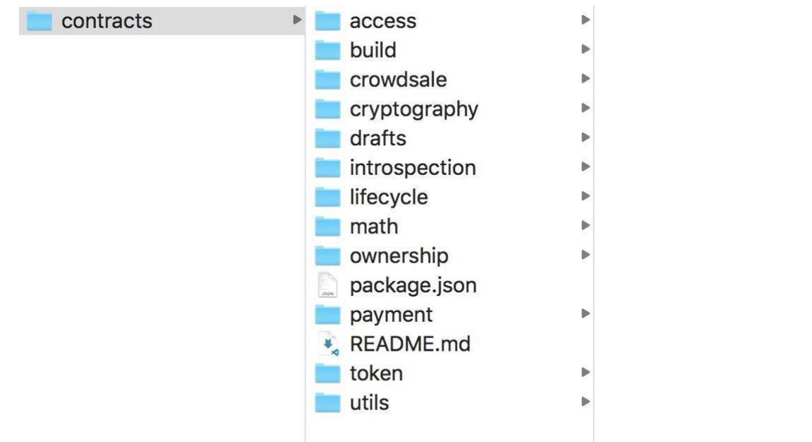

# OpenZeppelin

OpenZeppelin 是以太坊生态中一个非常了不起的项目，OpenZeppelin 提供了很多经过社区反复审计及验证的合约模板（如 ERC20、ERC721）及函数库（SafeMath），操作者在开发过程中，通过复用这些代码，不仅提高了效率，也可以显著提高合约的安全性。

为使用 OpenZeppelin 库，可以通过 npm 来安装 OpenZeppelin。

`npm install @openzeppelin/contracts `

安装完成之后，在项目的 node_modules/@openzeppelin/contract 目录下可以找到合约源码，不同用途的合约分成了 11 个文件夹，如图所示。



各个文件夹提供的合约功能如下。

- cryptography：提供加密、解密工具，实现了椭圆曲线签名及 Merkle 证明工具。
- introspection：合约自省功能，说明合约自身提供了哪些函数接口，主要实现了 ERC165 和 ERC1820。
- math：提供数学运算工具，包含 Math.sol 和 SafeMath.sol。
- token：实现了 ERC20、ERC721、ERC777 三个标准代币。
- ownership：实现了合约所有权。
- access：实现了合约函数访问控制功能。
- crowdsale：实现了合约众筹、代币定价等功能。
- lifecycle：实现声明周期功能，如可暂定、可销毁等操作。
- payment：实现合约资金托管，如支付（充值）、取回、悬赏等功能。
- utils：实现一些工具方法，如判断是否为合约地址、数组操作、函数可重入的控制等。

本教程使用的 OpenZeppelin 是 2.3.0 版本，随着版本的升级，内容可能有所变化，OpenZeppelin 使用起来很简单，通过 import 关键字引入对应的代码即可，以下代码为智能合约加入所有权功能。

```
pragma solidity ^0.5.0; 
import "@openzeppelin/contracts/ownership/Ownable.sol"; 
contract MyContract is Ownable { ... }
```

如果需要修改 OpenZeppelin 代码，找到 OpenZeppelin 代码库 GitHub 地址（[https://github.com/OpenZeppelin/openzeppelin-contracts](https://github.com/OpenZeppelin/openzeppelin-contracts)），通过 git clone 把代码拷贝到本地进行修改。 OpenZeppelin 涉及的内容较多，本章只挑选一些最常用的功能进行介绍，包括对整型运算进行安全检查的 SafeMath 库、地址工具的使用、用来发布合约接口的 ERC165，以及 3 个最常用的代币标准：ERC20、ERC777、ERC721。
